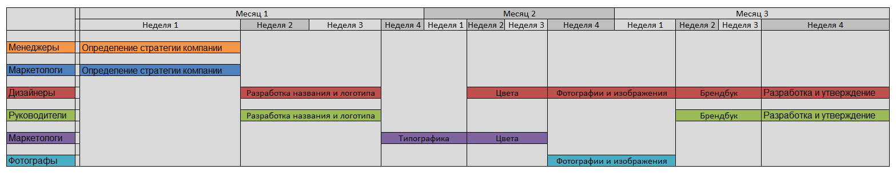

Для составления timeline проекта "Создание фирменного стиля для бренда" с задачами, сроками и участниками, можно использовать следующий подход:

1. Определение стратегии компании:
- Изучение аудитории и ее потребностей
- Позиционирование бренда
2. Разработка названия и логотипа:
- Создание уникального и запоминающегося логотипа
- Соблюдение лаконичности и простоты в дизайне
3. Типографика:
- Выбор шрифтов, которые отражают характер и ценности бренда
4. Цвета:
- Определение цветовой палитры, которая соответствует имиджу и целям компании
5. Фотографии и изображения:
- Выбор единого стиля и подхода к использованию графики и иллюстраций
6. Брендбук:
- Создание документа, который описывает все компоненты фирменного стиля, включая логотип, цвета, типографику и правила их использования
7. Разработка и утверждение:
- Разработка и утверждение фирменного стиля компании с участием всех заинтересованных сторон
8. Применение фирменного стиля:
- Внедрение фирменного стиля во все аспекты бизнеса, включая веб-сайт, маркетинговые материалы, упаковку продукции и т.д.

Вот пример таблицы, которая использована для составления timeline:

| Задача                              | Сроки        | Участники                   |
| ----------------------------------- | ------------ | --------------------------- |
| Определение стратегии компании      | Неделя 1     | Менеджеры, маркетологи      |
| Разработка названия и логотипа      | Неделя 2-3   | Дизайнеры, руководители     |
| Типографика                         | Неделя 4-5   | Дизайнеры                   |
| Цвета                               | Неделя 6-7   | Дизайнеры, маркетологи      |
| Фотографии и изображения            | Неделя 8-9   | Дизайнеры, фотографы        |
| Брендбук                            | Неделя 10-11 | Дизайнеры, руководители     |
| Разработка и утверждение            | Неделя 12-13 | Дизайнеры, руководители     |
| Применение фирменного стиля         | Постоянно    | Все сотрудники компании     |

