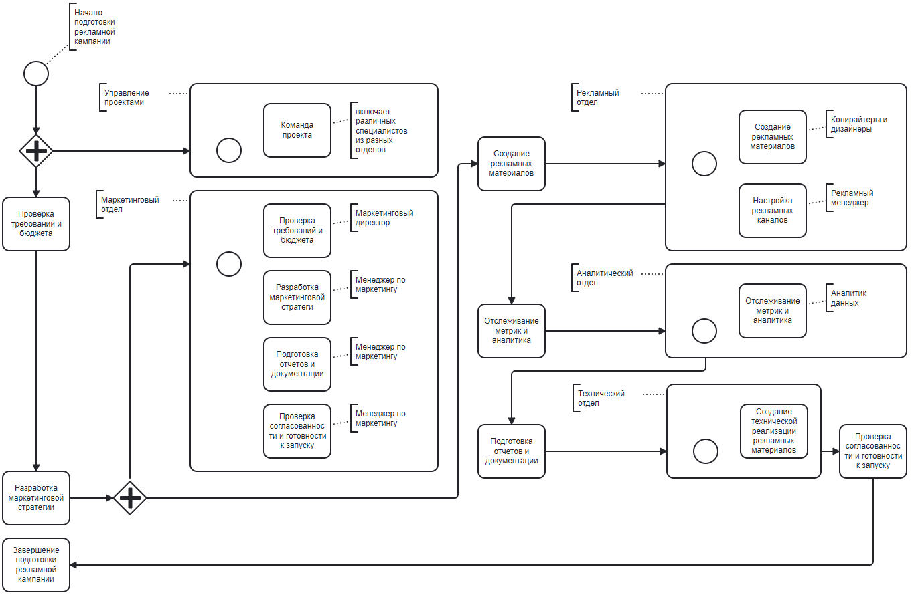

## 1. Перечислите основные и поддерживающие бизнес-процессы

Существует несколько типов бизнес-процессов, которые могут быть применены в компаниях. Некоторые из них напрямую влияют на прибыль компании, а другие являются вспомогательными и необходимы для поддержания работы основных процессов. 

Основные бизнес-процессы напрямую влияют на прибыль компании и включают в себя: 
- производство продукции, 
- оказание услуг 
- продажи.  

Поддерживающие процессы, также известные как вспомогательные процессы, необходимы для поддержания работы основных процессов и могут включать в себя: 
- бухгалтерский учет, 
- подбор персонала. 

Кроме того, существуют процессы управления, которые охватывают весь комплекс функций управления на уровне каждого бизнес-процесса и бизнес-системы в целом.  
Обеспечивающие процессы направлены на жизнеобеспечение всех остальных бизнес-процессов и ориентированы на поддержку их универсальных черт, такие как: 
- финансовое обеспечение деятельности, 
- кадровое обеспечение, 
- инженерно-техническое обеспечение.

## 2. Декомпозируйте процессы вашего отдела до 3-5 уровня

**Декомпозиция процесса отдела продаж:**

---
|Уровень 1|                                  |Продажи                 |компании                     |                                          |
|---------|----------------------------------|------------------------|-----------------------------|------------------------------------------|
|Уровень 2| Определение потребностей клиента | Предложение продукта   | Заключение сделки           | Обслуживание клиента                     |
|Уровень 3|– Анализ рынка                    |– Разработка продукта   |– Проведение переговоров     |– Поддержка клиентов после продажи        |
|Уровень 3|– Изучение конкурентов            |– Тестирование продукта |– Оформление документов      |– Решение проблем клиентов                |
|Уровень 3|– Интервьюирование клиентов       | Подготовка документации|– Согласование условий сделки|– Обучение клиентов использованию продукта|

## 3. Опишите 1 важный процесс в одной из нотации (BPMN, UML)

Процесс "Подготовка рекламной кампании" в нотации BPMN

## 4. Предложите инициативы по оптимизации бизнес-процессов (минимум 5)

Инициативы по оптимизации бизнес-процессов могут включать следующие шаги:

1. Измерение эффективности процесса. Это позволяет оценить текущую производительность и выявить узкие места. Различные методы измерения могут быть использованы, включая ключевые показатели производительности (KPI), бенчмаркинг и анализ данных.
2. Написание бизнес-регламента. Бизнес-регламент является документом, который определяет правила и процедуры, которые должны быть соблюдены при выполнении бизнес-процессов. Он помогает стандартизировать процессы и улучшить их эффективность.
3. Снижение цикличности. Частые переделки и доработки процессов могут привести к зацикливанию и снижению эффективности предприятия. Одна из идей по оптимизации процессов состоит в замене линейных проверок на использование бизнес-правил. Это позволяет автоматизировать проверку корректности данных и выполнение операций в процессе.
4. Автоматизация процессов. Использование информационных технологий и ИТ-систем для автоматизации бизнес-процессов может значительно повысить их эффективность. Это может включать автоматическую проверку данных, уведомления о задачах и автоматическое выполнение определенных операций.
5. Постепенное внедрение изменений. Оптимизация бизнес-процессов требует постепенного внедрения изменений и объяснения сотрудникам, почему эти изменения важны. Важно обеспечить поддержку и сотрудничество персонала, чтобы они выполняли новые поручения.

## 5. Посчитайте экономический эффект от каждой инициативы

**Экономический эффект** — разность между результатами деятельности хозяйствующего субъекта и произведенными для их получения затратами на изменения условий деятельности.  
Различают положительный и отрицательный экономический эффект.  
**Положительный экономический эффект** достигается в случае, когда результаты деятельности предприятия (продукт в стоимостном выражении) превышают затраты. Этот эффект называется **прибылью**. Для его получения необходимо расширение производства, либо экономия ресурсов на единицу продукта, либо и то, и другое.  
Если затраты превышают результаты, имеет место **отрицательный экономический эффект**, то есть **убыток**.

Для расчета экономического эффекта за год используют формулу:
$$\ EE_y = E_y - E_{nc}*C $$
где:
- Ey — годовая экономия, либо результаты, которые достигаются в результате конкретной деятельности;
- Enc — [[нормативный коэффициент эффективности]]; постоянная величина, которая зависит от конкретной сферы деятельности;
- C — затраты на конкретную деятельность, для которой подсчитывается экономический эффект.

## 6. Приоритизируйте инициативы с помощью фреймворка RICE

$$\ {RICE score} = \frac {(Reach * Impact * Confidence)}{Effort}$$

Для оценки гипотез по фреймворку RICE в проекте по оптимизации процесса доставки товаров, вам необходимо рассмотреть каждую гипотезу по следующим параметрам: Reach (охват), Impact (воздействие), Confidence (уверенность) и Effort (усилия).  

На основе имеющихся данных и общих принципов оптимизации логистики, можно предложить следующие гипотезы:  

**Гипотеза 1: Внедрение современных технологий для оптимизации логистики.**
- Reach: Высокий, так как это затронет все этапы доставки товаров.
- Impact: Высокий, так как использование современных технологий может значительно повысить эффективность доставки и снизить затраты.
- Confidence: Средний, так как требуется провести анализ и оценку конкретных технологий, их применимости и эффективности в данном проекте.
- Effort: Средний, так как внедрение новых технологий может потребовать времени и ресурсов для обучения сотрудников и настройки систем.

**Гипотеза 2: Создание системы оптимизации маршрутов доставки.**
- Reach: Средний, так как это затронет только процесс маршрутизации доставки товаров.
- Impact: Высокий, так как оптимизация маршрутов может сократить время доставки и улучшить обслуживание клиентов.
- Confidence: Высокий, так как существуют уже разработанные системы оптимизации маршрутов доставки, которые можно адаптировать под конкретные потребности проекта.
- Effort: Средний, так как требуется разработка и внедрение системы, а также интеграция с существующими системами управления.

**Гипотеза 3: Анализ и оптимизация бизнес-процессов логистики.**
- Reach: Средний, так как это затронет внутренние процессы и структуру организации.
- Impact: Высокий, так как оптимизация бизнес-процессов может привести к снижению издержек и повышению эффективности доставки.
- Confidence: Средний, так как требуется провести анализ текущих бизнес-процессов и определить оптимальные изменения.
- Effort: Высокий, так как требуется провести детальный анализ и пересмотреть существующие процессы и структуру организации.

**Исходя из оценки по фреймворку RICE, гипотеза 2 о создании системы оптимизации маршрутов доставки имеет наивысший приоритет, так как она обладает высоким воздействием на процесс доставки и имеет высокую уверенность в ее успешной реализации.**

## 7. Запланируйте проект (этапы, сроки, участники) по внедрению инициатив по оптимизации процессов

Для внедрения инициатив по оптимизации системы маршрутов доставки необходимо разработать проект, который будет включать следующие этапы, сроки и участников:

*Этапы проекта:*

1. Анализ текущей системы маршрутизации и доставки:
- Изучить текущие процессы доставки.
- Выявить проблемные места.
- Определить требования к новой системе оптимизации маршрутов.
2. Подготовка и выбор программного обеспечения:
- Исследовать различные программные продукты.
- Выбрать подходящее решение для оптимизации маршрутов доставки.
- Рассмотреть использование программного продукта "Легкая Логистика" на базе платформы 1С 8.3.
3. Разработка и настройка системы оптимизации маршрутов:
- Разработать систему оптимизации маршрутов доставки.
- Настроить систему с учетом требований и особенностей компании.
4. Тестирование и отладка системы:
- Провести тестирование системы оптимизации маршрутов доставки.
- Выявить и исправить возможные ошибки и проблемы.
5. Внедрение и обучение персонала:
- Внедрить систему оптимизации маршрутов доставки в рабочую среду.
- Провести обучение сотрудников, которые будут работать с системой.

*Сроки проекта:*

- Анализ текущей системы маршрутизации и доставки: 2 недели.
- Подготовка и выбор программного обеспечения: 1 неделя.
- Разработка и настройка системы оптимизации маршрутов: 4 недели.
- Тестирование и отладка системы: 2 недели.
- Внедрение и обучение персонала: 1 неделя.

*Участники проекта:*

- Менеджер проекта: ответственный за планирование, координацию и контроль выполнения проекта.
- Логист: ответственный за анализ текущей системы маршрутизации и доставки, определение требований к новой системе и настройку системы оптимизации маршрутов.
- IT-специалисты: ответственные за выбор и настройку программного обеспечения, разработку и тестирование системы оптимизации маршрутов доставки.
- Пользователи системы: сотрудники, которые будут работать с системой оптимизации маршрутов доставки.