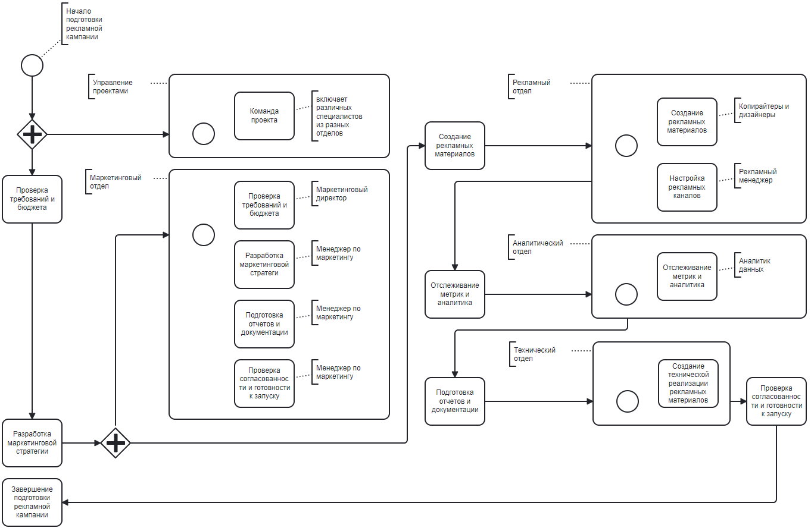

# Подготовка рекламной кампании

Процесс "Подготовка рекламной кампании" в нотации BPMN может быть представлен следующим образом:

### Начало процесса (Start Event): Запуск подготовки рекламной кампании.

### Исследование рынка (Task): Проведение исследования рынка для определения целевой аудитории и конкурентов. 

Подпроцессы для задачи "Исследование рынка" в процессе "Подготовка рекламной кампании" могут быть следующими:  

**Определение целевой аудитории:**

- Идентификация основных характеристик целевой аудитории, таких как возраст, пол, местоположение, интересы и поведение.
- Сбор данных о целевой аудитории из различных источников, таких как исследования рынка, опросы, аналитика веб-сайта и социальных медиа.
- Анализ и интерпретация собранных данных для определения ключевых сегментов целевой аудитории.  

**Анализ конкурентов:**

- Идентификация основных конкурентов на рынке, работающих в той же нише или предлагающих аналогичные продукты или услуги.
- Сбор информации о конкурентах, такую как их маркетинговые стратегии, цены, продукты и услуги, а также отзывы клиентов.
- Анализ и сравнение конкурентов для определения их преимуществ, слабых мест и потенциальных возможностей для разработки уникального предложения.

**Формирование отчета:**

- Составление подробного отчета, содержащего результаты исследования рынка, включая данные о целевой аудитории и конкурентах.
- Представление отчета команде или заинтересованным сторонам для обсуждения и принятия решений по стратегии рекламной кампании.

### Разработка стратегии (Task): Разработка стратегии рекламной кампании, включая выбор каналов продвижения и определение бюджета.

Подпроцессы для задачи "Разработка стратегии" в процессе "Подготовка рекламной кампании" могут быть следующими:

**Определение целей и задач:**

- Определение основных целей рекламной кампании, таких как увеличение узнаваемости бренда, привлечение новых клиентов или увеличение продаж.
- Разработка конкретных задач, которые должна выполнить рекламная кампания для достижения поставленных целей.  

**Идентификация целевой аудитории:**

- Определение целевой аудитории, которую необходимо достичь с помощью рекламной кампании.
- Анализ основных характеристик целевой аудитории, таких как возраст, пол, местоположение, интересы и поведение.

**Выбор каналов продвижения:**

- Исследование и анализ различных каналов продвижения, таких как телевидение, радио, печатные издания, интернет, социальные медиа и т.д.
- Определение наиболее подходящих каналов продвижения, учитывая целевую аудиторию, бюджет и цели рекламной кампании.

**Определение бюджета:**

- Оценка доступных ресурсов и финансовых возможностей для рекламной кампании.
- Распределение бюджета между различными каналами продвижения и маркетинговыми активностями.
- Установление ожидаемого ROI (возврата инвестиций) и определение приемлемого уровня затрат.

**Разработка сообщения и тон рекламы:**

- Определение ключевых сообщений и уникального предложения ценности, которые будут использоваться в рекламной кампании.
- Выбор подходящего тона и стиля коммуникации, который будет соответствовать целевой аудитории и целям кампании.

**Создание плана рекламной кампании:**

- Разработка детального плана рекламной кампании, включая расписание, бюджет, каналы продвижения, сообщения и метрики для измерения успеха.

### Создание рекламных материалов (Task): Создание рекламных материалов, таких как баннеры, видеоролики или тексты.

Подпроцессы для задачи "Создание рекламных материалов" в процессе "Подготовка рекламной кампании" могут быть следующими:

**Определение требований к рекламным материалам:**

- Сбор требований и спецификаций от команды или заинтересованных сторон, включая цели, сообщения, целевую аудиторию, форматы и размеры материалов.

**Разработка концепции и идей:**

- Генерация идей и концепций для рекламных материалов, учитывая требования и цели кампании.
- Создание макетов и эскизов для визуализации идей и концепций.

**Создание контента:**

- Написание текстов для рекламных материалов, таких как заголовки, подзаголовки, описания и призывы к действию.
- Создание графических элементов, таких как изображения, иллюстрации, логотипы и иконки.
- Создание видеороликов или анимаций, если они требуются для рекламной кампании.

**Дизайн и визуальное оформление:**

- Разработка дизайна и визуального оформления рекламных материалов, включая выбор цветовой схемы, шрифтов, композиции и стилей.
- Создание макетов и макетов для рекламных материалов, чтобы представить, как они будут выглядеть в конечном виде.

**Проверка и корректировка:**

- Проверка рекламных материалов на наличие ошибок, опечаток и несоответствий требованиям.
- Корректировка и внесение необходимых изменений в рекламные материалы на основе обратной связи и рекомендаций.

**Подготовка к публикации:**

- Подготовка рекламных материалов к публикации, включая экспорт в нужные форматы и размеры, подготовку файлов для печати или загрузку на платформы рекламы.

### Запуск рекламной кампании (Task): Запуск рекламной кампании на выбранных каналах продвижения.

Подпроцессы для задачи "Запуск рекламной кампании" в процессе "Подготовка рекламной кампании" могут быть следующими:

**Подготовка рекламных материалов:**

- Убедитесь, что все рекламные материалы, такие как баннеры, видеоролики или тексты, готовы к использованию и соответствуют требованиям каналов продвижения.

**Выбор каналов продвижения:**

- Определите наиболее подходящие каналы продвижения для вашей рекламной кампании, учитывая целевую аудиторию, бюджет и цели кампании.
- Рассмотрите различные варианты, такие как телевидение, радио, печатные издания, интернет, социальные медиа и т.д., и выберите те, которые наиболее эффективны для достижения ваших целей.

**Настройка рекламных каналов:**

- Создайте учетные записи и настройте рекламные каналы, такие как Google Ads, Facebook Ads, Instagram Ads и т.д.
- Загрузите рекламные материалы на соответствующие платформы и укажите необходимые настройки, такие как бюджет, расписание показов и целевую аудиторию.

**Установка метрик и отслеживание результатов:**

- Определите ключевые метрики, которые вы будете отслеживать для оценки эффективности рекламной кампании, такие как количество показов, кликов, конверсий и ROI.
- Установите отслеживание метрик с помощью инструментов аналитики, таких как Google Analytics или платформы рекламы.

**Мониторинг и оптимизация:**

- Регулярно отслеживайте результаты рекламной кампании и анализируйте данные, чтобы определить, какие каналы и объявления наиболее эффективны.
- Вносите необходимые корректировки и оптимизируйте кампанию, чтобы улучшить ее результаты и достичь поставленных целей.

**Отчетность и анализ:**

- Создайте отчеты о результате рекламной кампании, включая ключевые метрики и аналитические данные.
- Проанализируйте результаты и сравните их с поставленными целями, чтобы оценить успех кампании и определить улучшения на будущее.

### Мониторинг и анализ результатов (Task): Отслеживание и анализ результатов рекламной кампании, включая оценку эффективности и ROI.

Подпроцессы для задачи "Мониторинг и анализ результатов" в процессе "Подготовка рекламной кампании" могут быть следующими:

**Определение ключевых метрик:**

- Определите ключевые метрики, которые вы будете отслеживать для оценки эффективности рекламной кампании. Это могут быть метрики, такие как количество показов, кликов, конверсий, средний чек, стоимость привлечения клиента и ROI.

**Установка отслеживания метрик:**

- Установите отслеживание метрик с помощью инструментов аналитики, таких как Google Analytics или платформы рекламы. Убедитесь, что отслеживание настроено правильно и связано с вашими рекламными каналами.

**Сбор данных:**

- Регулярно собирайте данные о рекламной кампании, включая метрики, которые вы определили. Это может включать данные о показах, кликах, конверсиях, расходах и других показателях эффективности.

**Анализ результатов:**

- Анализируйте собранные данные, чтобы оценить эффективность рекламной кампании. Сравните фактические результаты с поставленными целями и оцените, насколько успешно кампания достигла своих целей.

**Идентификация трендов и паттернов:**

- Идентифицируйте тренды и паттерны в данных, чтобы понять, какие аспекты кампании работают хорошо, а какие требуют улучшений. Обратите внимание на различные сегменты аудитории, каналы продвижения и объявления.

**Оптимизация и корректировка:**

- На основе анализа результатов примите меры по оптимизации и корректировке рекламной кампании. Это может включать изменение бюджета, настройку таргетинга, оптимизацию объявлений или изменение стратегии продвижения.

**Создание отчетов:**

- Создайте отчеты о результате рекламной кампании, включая ключевые метрики и аналитические данные. Отчеты должны быть понятными и информативными, чтобы помочь вам принимать решения и делать выводы.

**Презентация результатов:**

- Подготовьте презентацию или отчет, чтобы представить результаты рекламной кампании заинтересованным сторонам. Объясните основные выводы, рекомендации и планы действий на основе анализа результатов.

### Окончание процесса (End Event): Завершение подготовки рекламной кампании.

Подпроцессы для задачи "Окончание процесса" в процессе "Подготовка рекламной кампании" могут быть следующими:

**Проверка завершенности всех предыдущих подпроцессов:**

- Убедитесь, что все предыдущие подпроцессы, связанные с подготовкой рекламной кампании, завершены и выполнены правильно. Проверьте, что все необходимые шаги и задачи были выполнены.

**Подготовка окончательных версий рекламных материалов:**

- Убедитесь, что все рекламные материалы, такие как баннеры, видеоролики или тексты, готовы к использованию и соответствуют требованиям каналов продвижения.
- Проверьте, что все материалы прошли финальную редактуру и проверку на соответствие бренду и целям кампании.

**Подготовка окончательных настроек рекламных каналов:**

- Проверьте, что все рекламные каналы, такие как Google Ads, Facebook Ads, Instagram Ads и т.д., настроены правильно и готовы к запуску.
- Убедитесь, что все необходимые настройки, такие как бюджет, расписание показов и целевая аудитория, установлены и проверены.

**Проверка отслеживания метрик:**

- Проверьте, что отслеживание метрик с помощью инструментов аналитики, таких как Google Analytics или платформы рекламы, работает корректно.
- Убедитесь, что все необходимые метрики настроены для отслеживания и связаны с вашими рекламными каналами.

**Подготовка окончательных отчетов и документации:**

- Создайте окончательные отчеты о подготовке рекламной кампании, включая все ключевые шаги, настройки и материалы.
- Подготовьте документацию, которая может быть полезна для будущих рекламных кампаний или для обучения других сотрудников.

**Проверка согласованности и готовности к запуску:**

- Проверьте, что все элементы рекламной кампании согласованы и готовы к запуску.
- Убедитесь, что все необходимые ресурсы, бюджеты и разрешения на запуск кампании доступны.

**Завершение процесса:**

- После завершения всех подпроцессов и проверки готовности, объявите официальное завершение процесса подготовки рекламной кампании.
- Уведомите заинтересованных сторон о завершении процесса и готовности к запуску кампании.

