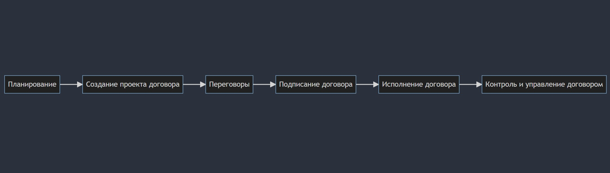

Оформление договора с подрядчиком или клиентом - это сложный процесс, который включает в себя несколько этапов. Этот процесс можно представить в виде таблицы и графического изображения для лучшего понимания.

Ниже представлена таблица этапов процесса оформления договора с подрядчиком или клиентом:

|              Этап             |                                                     Описание                                              |
|-------------------------------|-----------------------------------------------------------------------------------------------------------|
|Планирование                   |Определение целей и требований к проекту, выбор подходящего подрядчика или клиента                         |
|Создание проекта договора      |Составление проекта договора с учетом всех необходимых условий и требований                                |
|Переговоры	                    |Обсуждение проекта договора с подрядчиком или клиентом, внесение изменений и уточнений                     |
|Подписание договора	        |Окончательное согласование и подписание договора обеими сторонами                                          |
|Исполнение договора	        |Осуществление работ или услуг в соответствии с условиями договора                                          |
|Контроль и управление договором|Отслеживание выполнения условий договора, внесение изменений при необходимости, решение возникающих проблем|

Графическое изображение процесса оформления договора может быть представлено в виде диаграммы, где каждый этап - это отдельный блок, и стрелки указывают направление движения от одного этапа к следующему. Под каждым блоком можно добавить подробное описание этапа.

Ниже пример кода для создания такой диаграммы (этот код работает в системах, поддерживающих Mermaid для создания диаграмм, например, в некоторых системах управления контентом (CMS) или инструментах для визуализации данных):

```
graph LR
A[Планирование] --> B[Создание проекта договора]
B --> C[Переговоры]
C --> D[Подписание договора]
D --> E[Исполнение договора]
E --> F[Контроль и управление договором]
```

