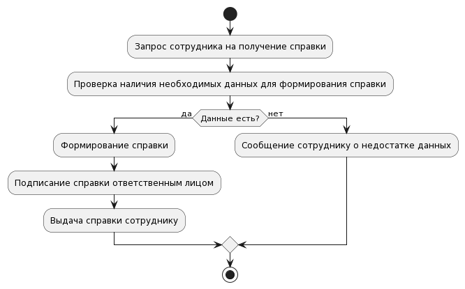

Для описания процесса "Выдача справки сотруднику" в нотации UML с использованием [PlantUML](https://plantuml.com "нотации UML онлайн"), можно использовать диаграмму активностей. 

```
@startuml
start
:Запрос сотрудника на получение справки;
:Проверка наличия необходимых данных для формирования справки;
if (Данные есть?) then (да)
  :Формирование справки;
  :Подписание справки ответственным лицом;
  :Выдача справки сотруднику;
else (нет)
  :Сообщение сотруднику о недостатке данных;
endif
stop
@enduml
```



**В этом примере использованы следующие шаги процесса:**

- Запрос сотрудника на получение справки
- Проверка наличия необходимых данных для формирования справки
- Формирование справки
- Подписание справки ответственным лицом
- Выдача справки сотруднику

Каждый шаг представлен в виде прямоугольника, соединенного стрелками, которые обозначают поток управления. Условный оператор `if` используется для проверки наличия данных. Если данные есть, процесс продолжается, иначе сотруднику сообщается о недостатке данных.

